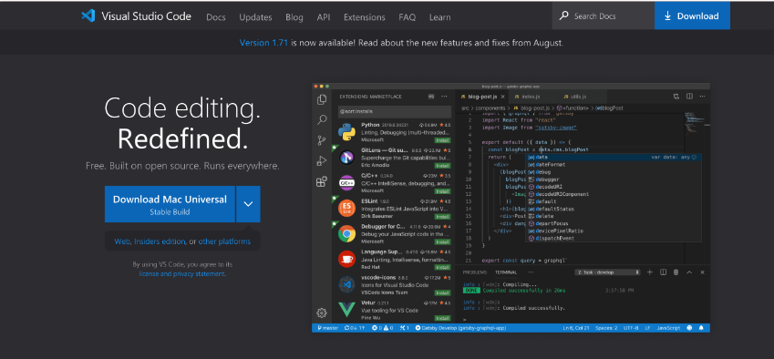
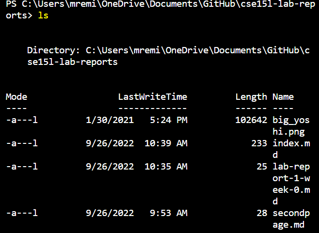
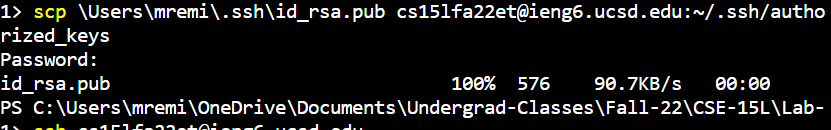
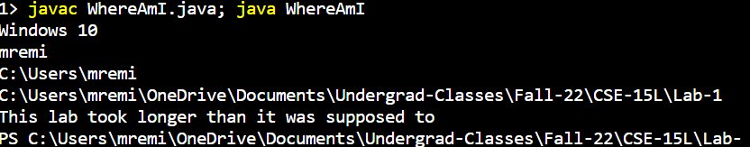
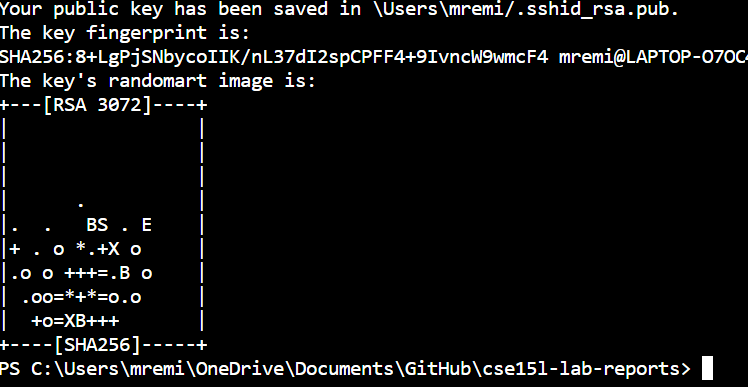
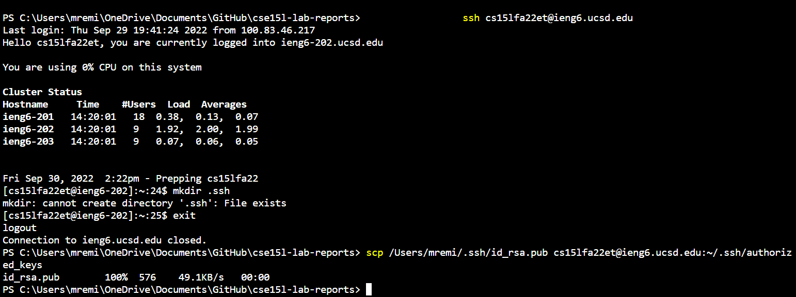

**How to Log into a course specific account**  

First, you will need to install VS code. Go to their website and click the download button on their page.

Once you go ahead and download VS code, find the terminal tab at the top of the page. There will be a drop down menu. Select "New Terminal" and there you will see your computer terminal through VS Code.

Go on VS Code and you should see the page as the following screenshot shows.  

To remotely connect to a server, you will have to use the ssh command in the terminal. In our case, you will connect to UCSD's CS server.  
Type: ssh cs15lfa22zz@ieng6.ucsd.edu  
In the terminal where zz is your account name. Once you enter, you will be asked to enter your password. Enter the password and you will have successfully connected to the server remotely. You should see something similar to what the following screenshot shows.  

Now, exit the server and you can try some commands out. Here is a list of commands that you can try out.  

- cd ~
- cd
- ls -lat
- ls -a

The following screenshot will give an example of a command I used:  

Now that you've gotten familiar, we can introduce moving files with scp. To do so, choose a java class of your that you would like to move into the CS server. This can be anything, preferably a class that prints something out so you know it works in the server. Once you have the file you want, type in the following command: 

scp ClassName.java cs15lfa22zz@ieng6.ucsd.edu:~/  

You will be prompted for a password. This will be the same password as before. This following screenshot shows what your terminal should look like.  

Now, connect to the remote server using the ssh command. To test that you successfully moved the java class, compile it, the run it using the followuing commands:  

javac JavaClass.java  
java JavaClass  

To save time entering commands, you can seperate commands on the same line using a semicolon. In the screenshot below, I typed "javac WhereAmI.java; java WhereAmI" to save time inputing commands. Here is a class that a ran on the server.  

Now, hasn't it been annoying having to type your password in everytime you want to connect or move a file? Well, you can bypass this by setting up an SSH Key.

To do this, exit the terminal and type in the command ssh-keygen. This creates a pair of files called public and private keys. Keep the private key in your client then copy the public key into the server. This will make it so you don't have to type in your password everytime you want to connect. Save the key to a file like the following.  

In your client, type in ssh cs15lfa22zz@ieng6.ucsd.edu  
Enter your password. Once you are on the server, type in mkdir .ssh then log out.  
Once you are back on you client, type the following command:  

scp *private key path* cs15lfa22zz@ieng6.ucsd.edu:~/.ssh/authorized_keys  

  

Once you do this, you can use ssh and scp commands without having to enter a password.
