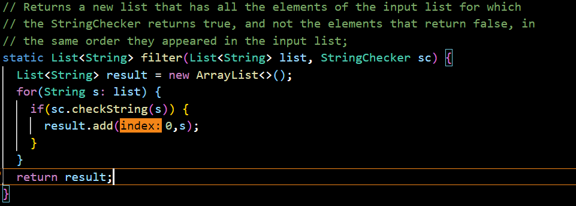

**Part One**

After compiling the code, to run the server, I type in “java SearchEngine 42069”. This starts the server and now I can go to localhost:42069. This brings me to the server I am running. This is already called the handleRequest method. Since there wasn’t anything in the query, it just went to the blank page.

In the image above, you can see that I typed "localhost:42069/add?s=ban" to add the word ban into the library. This calls the handleRequest method. The argument that passes through the method is the URL that we typed into the search bar. The method looks at the path, or anything after the first “/”. It checks to see what the path is, in this specific case, the path is “/add”. This specific string will then get the query, or anything that is after the first “?” and split the string into a list of strings that are split by the “=”. This list will have two elements, the second being the string that we want to add to the library. The program then adds the second element of the list to the library and returns the message shown above.

Now, to search for a string, we want to search for a substring and have a list of strings returned to pick through. To do this, we put /search?=ban.

I have added a few additional strings and those that have the substring “ban” in them get returned for the user to see. The same handleRequest method gets called, however this argument is now “localhost:42069/search?s=” instead of “localhost42069/add?s=”. This runs through a different if statement, in which the program will do the same process as above. It gets the path, seeing that it contains search instead of add. Then, if gets the query and splits the string into a list of two elements, separated by the =. The second element is the substring we are looking for. Now, we have an array list of strings that contains all of our words. This part of the method runs through the array list and checks if each string in it contains the substring “ban” in our case. It will then add the strings that match to a string that we will return. This ends up returning the words displayed above.

What happens if we don't search or add in the path? Well there is a third scenario.

In the case, I typed in localhost:42069/sbjbsdjkbvk, basically I indiscriminately spammed my keyboard. The argument going through the function handleRequest would be localhost:42069/sbjbsdjkbvk. The function looks at the path and since the path is not /, /search, or /add, it returns an error message “404 Not Found!”

**Part 2**

reverseInPLace bug:

From the ArrayExamples class, reverseInPlace was not working as intended. Here is the original code before fixing it: 

My failure inducing input was {1, 2, 3}:

The symptom was {3, 2, 3}:

The bug was that the code replaced the first index with the last index. So far it was correct, but when replacing the last index with the first index, the first index’s value was changed to the last index’s value. So when the code ran, it just kept the last index’s original value. To fix this, I added a temporary variable that would hold the first index’s original value even after it changed. Then, I set the last index’s value to the temporary variable which was the first index’s original value: 

I also ran the forloop to iterate the length of the list divided by two. This is because we are already switching the indicies at the end from the start, so we only really need to go through half the list. Also, if it is odd, then the middle index will switch with itself, still following the requirements.

Filter bug:

The second bug is from ListExamples in the filter method. Here is the original code: 

This method is supposed to use a boolean checker to see which elements in the list belong and which don’t. It will return an ArrayList of the strings that belong in the order that they were originally in. My StringChecker is called LongWordChecker. This will count the length of the string, and if it is longer than five words, it will return true.

The failure-inducing input for the filter method was {“hey”, “pedantic”, “fantastic”}:

 The expected outcome at element[0] was pedantic, but the actual outcome was “fantastic”:
 
 

 The bug was that the add method added the chosen words at index 0, changing the order in which the elements originally came in. To fix this, I just changed the add method to add the element at the end of the list. From add(index, element) to add(element) which adds the element at the end of the list:

 

