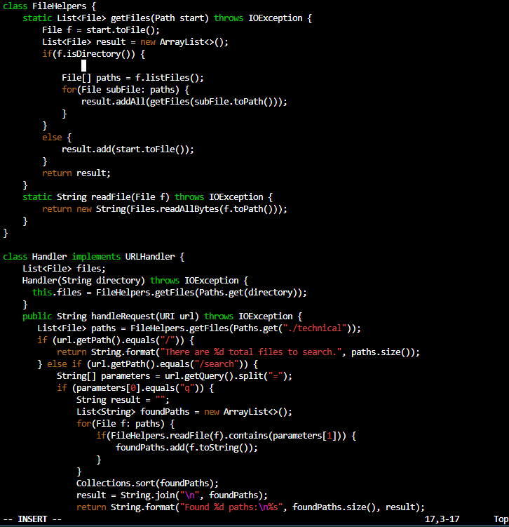
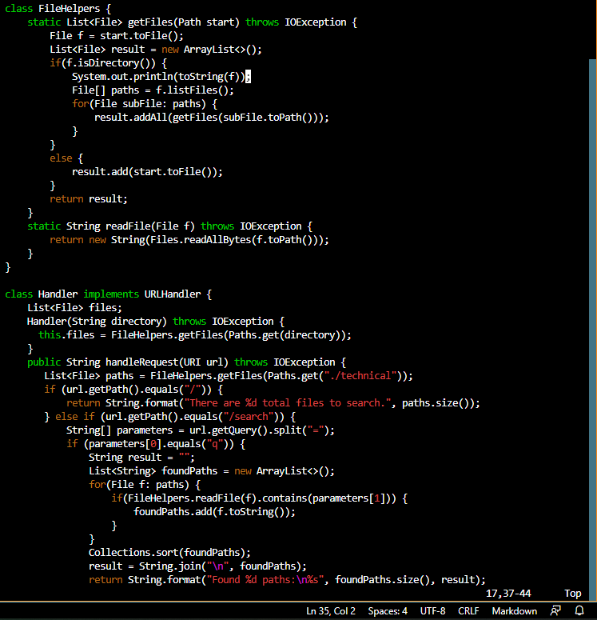

# Lab Report 4

**Part 1**

The challenge I chose to do was adding a new line to print before "File[] paths = f.listfiles()". I know we were supposed to try to keep it less than 30 key presses but the print line has 32 characters in it so I did my best. 

Below is what the vim interface looked like when I first got into the page.

Now, my thought process was to go to the end of the line that my cursor is at. To do this, I typed:

*$*

As you can see from the screenshot above, the cursor jumped straight to the end of the line using the *$* key which is the command to go to the end of the line. Now, I want to add a new line in. To do this, I'll type

*a \<enter>*

To go into insert mode using the append key, and enter to well... make a new line if you hadn't guessed it already.

I inlcuded the whole page because I want you to notice that the *a* command brought vim into insert mode and the enter command made a new line that indented itself. To make sure that it's in insert mode, look at the bottom left of the screenshot and you will see the miraculous "-- INSERT --" at the bottom left of the page indicating, you guessed it, that we are in insert mode. One thing that I do not like is the indentation because it's just wrong. So I typed the following commmand to make the proper indentation:

*\<backspace> \<space>* (four times)

 

 I don't know how thorough you want me to be with the screenshots so I'm going overboard to try and avoid a resubmit. But looking at the screenshot above, look!! It is now the proper indentation! Now, I'll type the actual line of code which is more than 30 characters so please excuse me for failing the assignment. I then typed the following:

 *System.out.println(toString(f)); \<esc>*

 

If you look at the screenshot above, you'll see that the print statment is now added. If you also check out the bottom left of the screenshot, you will see that I exited insert mode using the escape key. Now, all I need to do is save the file. To do this we type:

*:w \<enter>*

I just took a screenshot of the bottom of the page because that's the only thing that really changes when we press the keys above. After pressing \<enter>, we save the changes and all is good with the world.

**Part 2**
The first method, where I changed the file locally, scp it to the remote server, then running the bash script, it took me about 2 minutes and 40 seconds. By already being logged into the ssh server, going into vim to make the edits, then running the bash script, it took me about 1 minute and 10 seconds. A considerably faster time. 

I would much rather prefer working on vim than doing the changes locally and having to scp it every time I made changes. I think a big part of the reason why vim was so much faster is that scping an entire directory takes a long time. I also know that as I use vim more often, I will get better at it and my time to make edits will be even shorter. I know that in this case, having to write down my whole process in part one basically branded it in my brain, so I immediately knew the steps to take. If I continue working in vim, then my editing process will be much faster.