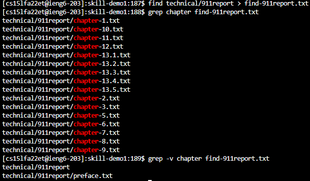
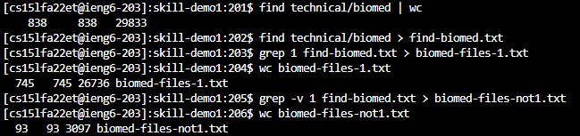
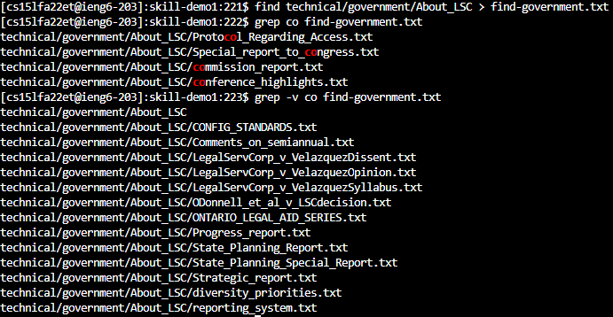
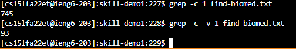
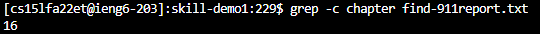
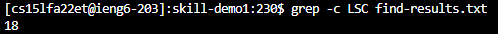
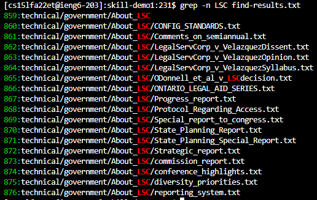
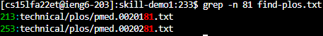
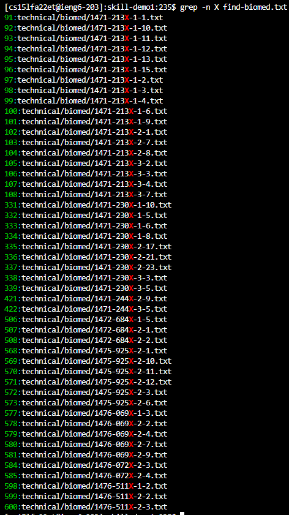

## Lab Report 3

The grep command is very useful when trying to find files with specific patterns in them. There are a few command line options that I would like to go over that make grep much more versatile.

-v command line option:

Just as grep would return those lines that matched the pattern name, -v inverses it to where grep returns anything but the pattern. Say you want to look through files but most of them have the same pattern you don't want. -v makes it so that you can selectively not look through those files and see whatever is left.

In the screenshot above, I made a txt file containing only the 911report folder's files. I then used the grep command to find all of the files with "chapter" in the path:

grep chapter find-911report.txt

Then I used the -v command line option to find anything but those paths that have "chapter" in them:

grep -v chapter find-911report.txt

This returned the only two paths without "chapter" in them.

This next example, I focused on the word counts. I put all the paths in the biomed folder into a txt file called find-biomed.txt. Notice how there are a total of 838 files in the biomed folder. Then, I type the following commands to find the number of file paths with the number 1 in their path.

grep 1 find-biomed.txt > biomed-files-1.txt

wc biomed-files-1.txt

Notice how there are 745 paths with the number 1 in their file. We can then infer that there would be 93 paths without the number 1 in their paths. To confirm this, I ran the following commands:

grep -v 1 find-biomed.txt > biomed-files.txt

wc biomed-files-not1.txt

From the screenshot above, you can see that there are 93 files without the number 1 in their path.

In this example, I accessed the LSC folder. I put all their paths into a txt file called find-government.txt. Just as an example, I ran the command:

grep co find-government.txt

grep -v co find-government.txt

As you can see in the screenshot above, the grep command with -v did not include any of the files that grep without the command line option returned.

-w command line option: 

Notice how in the second example above, I had to use muliple lines to find the word counts of the files? Well, there is a seperate command line option that returns the number of matching lines, so I do not have to use a seperate line to get the line count.

To bring it back to the second example above, we know that there are a total of 838 files in the biomed folder. Well I will run the same grep commands to show the amount of files there are with 1 in their path and without 1 in their path.

grep -c 1 find-biomed.txt

grep -c -v 1 find-biomed.txt

These commands output almost the same information in 2 lines as the other example did in 4 lines. 

In this example, I wanted to find how many files had chapter in their path. Instead of making a file to store the grep results and then using the wc command to find the lines, or even using a pipe to the wc command, I can just add the -c command line option and get the answer I need. The screenshot above shows how many files in the 911report folder have "chapter" in their path name. If you want to confirm, look at example one in the -v section and count the output of the grep command.

In this example, I wanted to know how many files there were in the About_LSC folder. This simple command line option lets me see it in one line.

-n command line option:

If you're ever curious about where the line that matches the pattern is, -n is your friend. -n assigns a line number to each line and will output the number line for those that match the grep pattern.

In the example above, I was curious not only what files had LSC in their path, but also their relative positions to each other. 

grep -n LSC find-results.txt

The above command allowed me to do this because now I can see which line number each of the files are in.

In this example, I used the find command to get all the files in plos and put the result in a folder names find-plos.txt. Out of the name plos files, I wanted to know which ones had 81 in their path and where they were. 

grep -n 81 find-plos.txt

As you can see, running this command showed where the pattern matched (in red) and what lines they are in (in green).

Running the following command:

grep -n X find-biomed.txt

I found all of files with X in their path and their positions in the biomed folder.